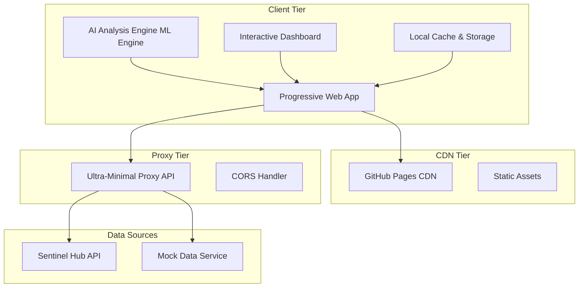

# 🏗️ SatChat 시스템 아키텍처 설계

## 아키텍처 개요

SatChat은 **Client-Heavy Architecture** 패턴을 기반으로 한 혁신적인 해양 모니터링 시스템입니다. 클라이언트에서 대부분의 처리를 수행하고 서버는 최소한의 프록시 역할만 담당하여 인프라 비용과 복잡도를 극적으로 줄였습니다.

## 🎯 설계 원칙

### 1. Client-First Principle
- **브라우저 중심 설계**: 최신 웹 기술을 활용한 클라이언트 사이드 처리
- **Progressive Enhancement**: 기본 기능부터 고급 기능까지 점진적 향상
- **Offline-First**: 네트워크 연결 없이도 핵심 기능 사용 가능

### 2. Resource Optimization
- **서버 부하 최소화**: 단순한 프록시 API로 서버 리소스 절약
- **클라이언트 최적화**: 브라우저 캐싱과 로컬 스토리지 활용
- **적응적 로딩**: 사용자 환경에 따른 점진적 기능 로딩

### 3. Scalability by Design
- **무한 확장성**: 클라이언트 처리로 서버 확장 부담 없음
- **Global Distribution**: CDN 기반 전 세계 동일한 성능
- **Cost Efficiency**: 인프라 비용 최소화

## 🏛️ 시스템 구조

### High-Level Architecture



### Component Architecture

#### 1. Client Tier (브라우저)
```javascript
// 핵심 컴포넌트 구조
SatChatClient = {
    // ML 처리 엔진
    MLEngine: {
        aiEngine: "브라우저 ML 추론",
        modelLoader: "적응적 모델 로딩",
        preprocessing: "이미지 전처리"
    },
    
    // 사용자 인터페이스
    Dashboard: {
        mapComponent: "Leaflet 기반 지도",
        analysisPanel: "실시간 분석 결과",
        controlPanel: "사용자 제어"
    },
    
    // 데이터 관리
    DataManager: {
        localStorage: "브라우저 로컬 저장",
        cacheManager: "지능형 캐싱",
        offlineSync: "오프라인 동기화"
    },
    
    // 통신 모듈
    ApiClient: {
        proxyConnector: "프록시 API 연결",
        retryLogic: "네트워크 오류 복구",
        fallbackData: "오프라인 데이터"
    }
}
```

#### 2. Proxy Tier (서버)
```python
# Ultra-Minimal Proxy API 구조
class MinimalProxy:
    """
    초경량 프록시 API
    - CORS 처리
    - 데이터 중계
    - 기본 헬스체크
    """
    
    def cors_handler(self):
        """모든 클라이언트 요청 허용"""
        return {"Access-Control-Allow-Origin": "*"}
    
    def data_proxy(self, request):
        """외부 API 데이터 중계"""
        return self.forward_to_external_api(request)
    
    def health_check(self):
        """서비스 상태 확인"""
        return {"status": "healthy", "mode": "proxy"}
```

## 🔄 데이터 플로우

### 1. 일반적인 분석 플로우
```
1. 사용자 요청 (브라우저)
   ↓
2. 로컬 캐시 확인
   ↓
3. 프록시 API 호출 (필요시)
   ↓
4. 외부 데이터 수신
   ↓
5. 클라이언트 ML 처리
   ↓
6. 결과 표시 + 캐시 저장
```

### 2. 오프라인 플로우
```
1. 사용자 요청 (브라우저)
   ↓
2. 로컬 캐시/스토리지 검색
   ↓
3. Mock 데이터 활용
   ↓
4. 클라이언트 ML 처리
   ↓
5. 결과 표시 (오프라인 표시)
```

## 🚀 기술 스택

### Frontend Technologies
```yaml
Core:
  - HTML5/CSS3: 표준 웹 기술
  - Vanilla JavaScript: 프레임워크 없는 순수 JS
  - Progressive Web App: PWA 표준 구현

ML & Analytics:
  - AI Analysis Engine: 브라우저 머신러닝
  - Chart.js: 데이터 시각화
  - D3.js: 고급 시각화 (선택적)

Mapping & GIS:
  - Leaflet.js: 경량 지도 라이브러리
  - OpenStreetMap: 무료 지도 타일
  - GeoJSON: 지리 데이터 형식

UI Framework:
  - Tailwind CSS: 유틸리티 CSS 프레임워크
  - Custom Components: 재사용 가능한 컴포넌트
```

### Backend Technologies
```yaml
Proxy API:
  - FastAPI: 고성능 Python 웹 프레임워크
  - Uvicorn: ASGI 서버
  - Minimal Dependencies: 5개 이하 패키지

Deployment:
  - Render: 서버 배포 플랫폼
  - GitHub Pages: 클라이언트 배포
  - Docker: 컨테이너화 (선택적)
```

## 📈 성능 최적화

### Client-Side Optimizations

#### 1. Adaptive Loading
```javascript
// 환경별 적응적 로딩
const adaptiveLoader = {
    // 고성능 환경
    highEnd: {
        modelSize: "full",
        concurrent: true,
        cacheSize: "large"
    },
    
    // 저성능 환경
    lowEnd: {
        modelSize: "lite", 
        concurrent: false,
        cacheSize: "small"
    }
};
```

#### 2. Intelligent Caching
```javascript
// 다층 캐싱 전략
const cacheStrategy = {
    L1: "브라우저 메모리 캐시",
    L2: "로컬 스토리지",
    L3: "IndexedDB (대용량)",
    TTL: "Time-To-Live 기반 만료"
};
```

### Server-Side Optimizations

#### 1. Minimal Resource Usage
```python
# 메모리 사용량 최적화
RESOURCE_LIMITS = {
    "max_memory_mb": 50,
    "max_cpu_percent": 30,
    "max_connections": 100,
    "timeout_seconds": 10
}
```

#### 2. Request Optimization
```python
# 요청 최적화
REQUEST_OPTIMIZATION = {
    "compression": "gzip",
    "keep_alive": True,
    "connection_pooling": True,
    "response_caching": 300  # 5분
}
```

## 🔒 보안 설계

### Client Security
- **Content Security Policy**: XSS 방지
- **HTTPS Enforced**: 모든 통신 암호화
- **Local Data Encryption**: 민감 데이터 로컬 암호화

### API Security
- **CORS Policy**: 적절한 CORS 설정
- **Rate Limiting**: API 남용 방지
- **Input Validation**: 모든 입력 검증

## 📊 모니터링 & 로깅

### Client Monitoring
```javascript
// 클라이언트 성능 모니터링
const performanceMonitor = {
    loadTime: "페이지 로딩 시간",
    mlInference: "ML 추론 시간", 
    apiResponse: "API 응답 시간",
    memoryUsage: "브라우저 메모리 사용량"
};
```

### Server Monitoring
```python
# 서버 리소스 모니터링
MONITORING_METRICS = {
    "cpu_usage": "CPU 사용률",
    "memory_usage": "메모리 사용량",
    "request_count": "요청 수",
    "error_rate": "오류 비율"
}
```

## 🔄 확장성 설계

### Horizontal Scaling
- **클라이언트 확장**: CDN 기반 무제한 확장
- **프록시 확장**: 필요시 인스턴스 추가
- **데이터 소스 확장**: 새로운 API 소스 추가

### Vertical Scaling
- **클라이언트 최적화**: 더 나은 브라우저 활용
- **서버 최적화**: 리소스 효율성 개선

## 🚀 배포 아키텍처

### Production Deployment
```yaml
Client:
  Platform: GitHub Pages
  CDN: Global distribution
  Caching: Browser + CDN caching
  
Proxy:
  Platform: Render
  Scaling: Auto-scaling enabled
  Monitoring: Built-in metrics
  
CI/CD:
  Source: GitHub Repository
  Automation: GitHub Actions
  Testing: Automated testing pipeline
```

## 💡 아키텍처의 장점

### Business Benefits
- **낮은 운영비용**: 서버 리소스 최소화
- **빠른 확장성**: 클라이언트 중심 확장
- **높은 가용성**: 클라이언트 캐싱으로 장애 대응

### Technical Benefits  
- **현대적 기술**: 최신 웹 표준 활용
- **유연한 개발**: 프론트엔드 중심 개발
- **쉬운 유지보수**: 단순한 서버 구조

### User Benefits
- **빠른 응답속도**: 로컬 처리로 지연시간 최소화
- **오프라인 지원**: 네트워크 없이도 기본 기능 사용
- **일관된 경험**: 전 세계 동일한 사용자 경험

---

*이 아키텍처는 현대적인 웹 기술의 장점을 최대한 활용하여 비용 효율적이고 확장 가능한 해양 모니터링 시스템을 구현합니다.*